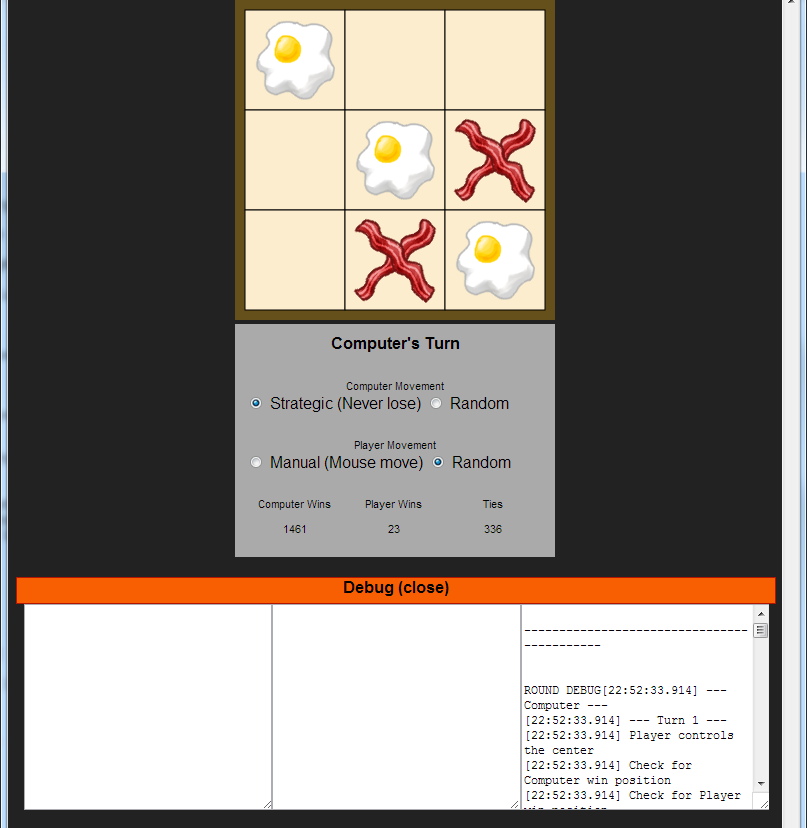

# Tic Tac Toe / Rachel J. Morris

This is my version of Tic-Tac-Toe.

## Notes:

AI:
* If the computer goes first, it will always win
* The computer AI for when the player goes first is not perfect - it will occasionally lose.

Tools:
* Written with JS/HTML5, because it's a little more portable than PyGame/Python on Windows platforms.

# Intructions:
1. Fork this repo on GitHub
2. Create a program that can interactively play the game of Tic-Tac-Toe against a human player and never lose.
3. Commit early and often, with good messages.
4. Push your code back to GitHub and send us a pull request.

